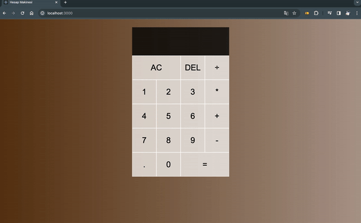

# Hesap Makinesi Uygulaması

Bu proje, React kütüphanesi kullanılarak geliştirilmiş basit bir hesap makinesi uygulamasını içerir. Hesap makinesi temel matematiksel işlemleri gerçekleştirebilir, sayıları düzenleyebilir ve sonucu görüntüleyebilir.

## Özellikler

- Toplama, çıkarma, çarpma ve bölme gibi temel matematik işlemlerini gerçekleştirme yeteneği.
- Sayıları ekleyebilme, silebilme ve düzenleyebilme özelliği.
- Hesaplama sonuçlarını temizleme ve geçmiş işlemleri görebilme yeteneği.

## Kullanılan Teknolojiler

- **React:** Kullanıcı arayüzünü oluşturmak ve bileşenleri yönetmek için kullanılmıştır.
- **JavaScript:** Uygulamanın temel programlama dili.
- **CSS:** Kullanıcı arayüzünü stilize etmek için kullanılmıştır.

## Uygulama Nasıl Çalışır?

- Kullanıcı, hesap makinesi üzerindeki butonlara tıklayarak sayılar ekleyebilir, işlemleri seçebilir ve sonuçları görebilir.
- "AC" butonuna tıklayarak tüm işlemleri sıfırlayabilir.
- "DEL" butonuyla bir önceki hane silinebilir.
- "=" butonuna tıklayarak hesaplama sonuçlarını elde edebilir.

## Nasıl Başlatılır?

1. Projeyi bilgisayarınıza klonlayın.
   ```bash
   git clone https://github.com/avcisalih/calculator
   ```

2. Proje dizinine gidin.
   ```bash
   cd hesap-makinesi-uygulamasi
   ```

3. Bağımlılıkları yükleyin.
   ```bash
   npm install
   ```

4. Uygulamayı başlatın.
   ```bash
   npm start
   ```

5. Tarayıcınızda [http://localhost:3000](http://localhost:3000) adresine gidin.

Umarım bu hesap makinesi uygulaması, temel React becerilerinizi geliştirmenize yardımcı olur!


